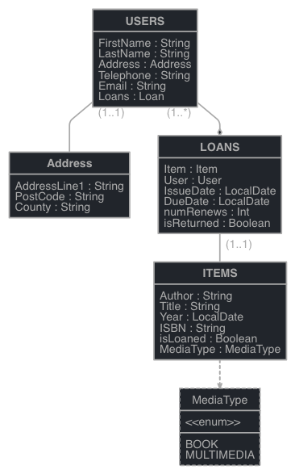

# Library Management Application

A simple fullstack web Application for library admins to manage users and loans of items

## Tech Stack

**Client:** React, React-bootstrap

**Server:** Spring Boot, mySQL

**Build Tool:** Maven 

**Security:**  CodeQl

## Model

## Features

- Ability to add users
- Ability to renew/ return loans and create new loans using userId and itemId's
- Ability to add new items and delete items

## Versions 

- React 18.2.0
- Spring Boot 2.7.2
- OpenJdk 17.0.4.1

## How to run

- You must have npm along with the latest LTS version of node installed

- Clone repo and cd into frontend module and run command " npm start " to run the client  
- Then run maven to download dependencies and then build and run the java application either within the ide or as a 
  jar file (demo-0.0.1-SNAPSHOT.jar) located within the target directory. 

## Feedback

If you have any feedback, please reach out to me at dylanpab1@gmail.com
